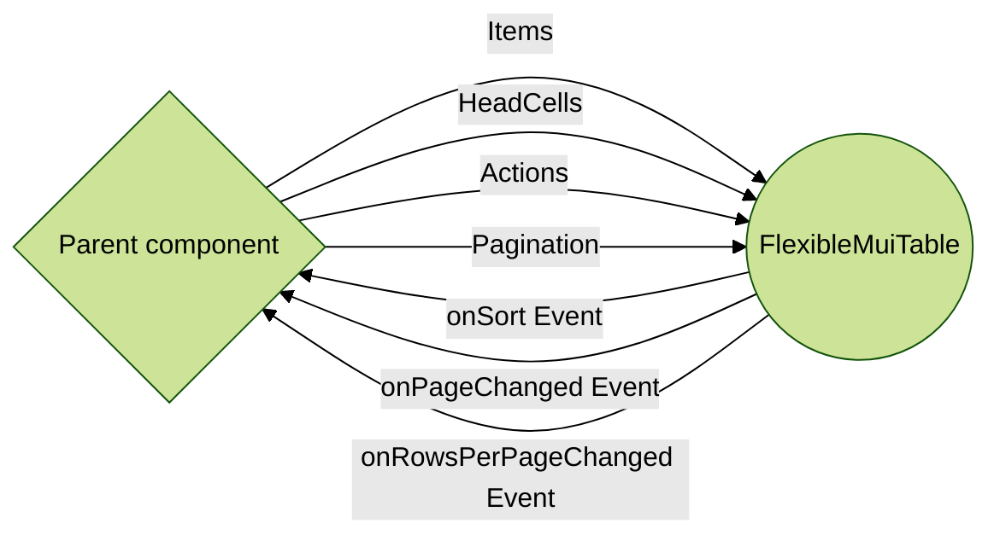

# flexibleMuiTable

Full customizable generic MUI table React component
- 100 % Typescript
- Full customization
- A presentational component
- Respect of **Open/Closed principles** with a full extensibility
    1. Add of pagination on demand
    2. Add of row actions on demand
    3. Add collapse feature to show more details on demand
    4. Smart cells building by passing a render method. Example: *use a chip component for a specific cell*  
- Support of  **Sorting**, **Pagination**, **Collapsible Table**
- Generic component that allows to pass your data type into your component making it reusable, strongly typed and clean. For instance if you wanna use it for TODO list, here is the clean way

   ```jsx
   export Interface TODO {
	   name: string
	   status: 'pending' | 'done'
   }
   ...
   <FlexibleMuiTable<TODO>  ...props />
   ```

## 🍴 How to use it?
### Installation
`npm install flexible-mui-table`
Or
`yarn add flexible-mui-table`
### Full example
 ```jsx
 // import the component and exported types that you need
 import { FlexibleMuiTable, HeadCell, Action, Order } from  'flexible-mui-table'
 
export Interface TODO {
   name: string
   status: 'pending' | 'done'
  }
// Usually data came from an http call
const dummy_todos = [{name: 'todo1', status: 'pending'},{name: 'todo2', status: 'done'}]

export const TODOS = () => {
  const [todos, setTodos] =  useState(dummy_todos)
  const [pagination, setPagination] =  useState({
      page: 0,
      rowsPerPage: 25,
      count: dummy_todos.length,
  })
  
 // Head Cells
const todoCells:  HeadCell<TODO>[] = [
	{
		id: 'name',
		label: 'Name',
		render: (value) => value,
		showOnCollapse: false,
	},
	{
		id: 'status',
		label: 'Status',
		render: (value) => (<Chip  color='success'  icon={<PendingIcon/>} label={value} variant='outlined' />),
		showOnCollapse: false,
	}
]
  
// Row Actions
const todoActions:Action<TODO>[] = [
	{
		id: 'edit',
		render: (todo:  TODO) => (<MenuItem  id='edit-menu-item'  key={`edit-${todo.name}`} onClick={(e) =>  handleEdit(e, todo)}> <EditIcon/> Edit </MenuItem>)
	},
	{
	  id: 'remove',
	  render: (todo:  TODO) => (<MenuItem  id='remove-menu-item'  key=	 {`remove-${todo.id}`} onClick={(e) =>  handleRemove(e, todo)}> <DeleteIcon /> Remove </MenuItem>)
   },
]

// Trigger a new http call based on the following events 
// [sort, page/rowsPerPage changes, row actions]

const onSortEvent = (sortBy: string, order: Order) => {
	console.log(`${sortBy}-${order}`)
}
const pageChanged = (page:  number) => {
	setPagination({ ...pagination, page })
}
const rowsPerPageChanged  = (rowsPerPage:  number) => {
	setPagination({ ...pagination, rowsPerPage, page: 0 })
}
const handleRemove = (e: React.MouseEvent<HTMLLIElement, MouseEvent>, todo: TODO) => console.log('REMOVE CALLED ON', todo)

const handleEdit = (e:  React.MouseEvent<HTMLLIElement, MouseEvent>, todo:  TODO) => console.log('EDIT CALLED ON', todo)

  return (
    <FlexibleMuiTable<TODO>
			items={todos}
			pagination={pagination}
			headCells={todoCells}
			actions={todoActions}
			onPageChanged={(page: number) => pageChanged(page)}
			onRowsPerPageChanged={(rowsPerPage: number) =>  rowsPerPageChanged(rowsPerPage)}
			onSort={(sortBy: string,order: Order) => onSortEvent(sortBy, order)}
		/>
    )
}
 
 ``` 
After installation done, let's start by the props (props and callback props).
FlexibleMuiTable flow chart:



Here is the props type of our magic component
```typescript
export interface FlexibleTableProps<T> {
  items: T[]
  headCells: HeadCell<T>[]
  actions?: Action<T>[]
  pagination?: Pagination
  onSort?: (sortBy:  keyof  T, sortOrder:  Order) =>  void
  onPageChanged?: (page:  number) =>  void
  onRowsPerPageChanged?: (rowsPerPage:  number) =>  void
}
```

### Props

#### items (required)
Items property  is the data array of type T[]

#### headCells (required)
HeadCells is an easy and complete way  to define your table head cells, their ids, labels, and how to render each cell using a render method that returns a **ReactNode**.
If you need to enable Collapse features on your  table, you have to set showOnCollapse to true on  at least one element of the todoCells below.
Properties that have **showOnCollapse** equal to true will be displayed on the collapse content.
Check Mui docs for more details https://mui.com/material-ui/react-table/#collapsible-table  

For our TODO example, a headCells array that you have to prepare should look like this:
```typescript
import { HeadCell } from  'flexible-mui-table'
const  todoCells: HeadCell<TODO>[] = [
 {
  id: 'name',
  label: 'Name',
  render: (value) =>  value,
  // showOnCollapse is used to distinguish cells that are visible by default
  // and those displayed on collapse event when isCollapsible is true
  showOnCollapse: false,
 },
 {
  id: 'status',
  label: 'Status',
  // You have to possibility to render the status as a ReactNode
  render: (value) => (<Chip color='success' icon={<PendingIcon/>} label={value} variant='outlined' />),
  showOnCollapse: false,
 }
]
```
🚨  *Only the properties that are present in headCells config can be shown inside FlexibleMuiTable component*

#### actions (optional)
Full customizable list of row actions. Here is how you add EDIT/REMOVE actions to a TODO row by defining
1. The rendering
2. The callback for that action event

```typescript
import { Action } from  'flexible-mui-table'
const  todoActions:Action<TODO>[] = [
  {
   id: 'edit',
   render: (todo: TODO) => (<MenuItem  id='edit-menu-item'  key={`edit-${todo.name}`} onClick={(e) =>  handleEdit(e, todo)}>
              <EditIcon/> Edit </MenuItem>),
 },
 {
  id: 'remove',
  render: (todo: TODO) => (<MenuItem id='remove-menu-item' key={`remove-${todo.id}`} onClick={(e) =>  handleRemove(e, todo)}>
    <DeleteIcon  /> Remove </MenuItem>),
 },
]
```

#### pagination (optional)
A pagination object that contains **the current page, rows per page and count**.
```typescript
export interface Pagination {
  page:number
  rowsPerPage:number
  count:number
}
```
🚨  *If pagination is not present in component props the pagination feature is disabled*
🚨  *default rowsPerPage values are [5, 15, 25], But it can be changed based on your rowsPerPage value if it not in the default range*

#### onSort (callback)
Get the event when the user clicks on one of the table headers to sort the values

```jsx
import { Order } from  'flexible-mui-table'
<FlexibleMuitable<TODO>
  items={todos}
  pagination={pagination}
  headCells={todoCells}
  actions={todoActions}
  onSort={(sortBy: string,order: Order) => console.log(`Sorting: ${sortBy}${order}`)}
/>
```
It provides the **sortBy** and the **order**  ('desc' | 'asc')

#### onPageChanged (callback)
Get the event when the user clicks on next or previous page

```jsx
<FlexibleMuitable<TODO>
  items={todos}
  pagination={pagination}
  headCells={todoCells}
  actions={todoActions}
  onPageChanged={(page: number) => pageChanged(page)}
/>
```
It provides the **current page** as a number

#### onRowsperPageChanged (callback)
Get the event when the user change the number of rows per page from the dropdown list

```jsx
<FlexibleMuitable<TODO>
  items={todos}
  pagination={pagination}
  headCells={todoCells} 
  actions={todoActions}
  onRowsPerPageChanged={(rowsPerPage: number) =>  rowsPerPageChanged(rowsPerPage)}
/>
```
It provides the **rows per page** as a number

